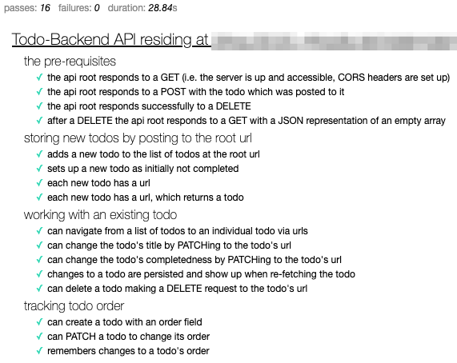

# Todo Backend with Gin and AstraDB

Implementation of [DataStax BootCamp: Full Stack Apps with Cassandra](https://github.com/datastaxdevs/bootcamp-fullstack-apps-with-cassandra/tree/main/week4-api-microservices) in Go

## Setup

1. [Create AstraDB Token](https://github.com/datastaxdevs/bootcamp-fullstack-apps-with-cassandra/tree/main/week4-api-microservices#2-create-astra-token) to obtain `Client_ID` and `Client_Secret`
2. Create AstraDB instance
3. Download the [Secure Connect Bundle](https://github.com/datastaxdevs/bootcamp-fullstack-apps-with-cassandra/tree/main/week4-api-microservices#2-create-astra-token)
4. Create `.env` from `.env.sample`
5. Using the CQL Console, create the required keyspace and tables
6. `go run main.go`

## API Endpoints

Verified against [TodoBackEnd Specs](https://todobackend.com/specs/index.html)


### /todos

- `GET` Retrieve complete list of all todos
- `POST` Create a todo
- `DELETE` Delete all todos

### /todos/:id

- `GET` Get a todo
- `DELETE` Delete a todo
- `PATCH` Modify a todo

## Models

### Setup via CQL Console
```
CREATE TABLE todos.todoitems (
    user_id text,
    item_id timeuuid,
    title text,
    url text,
    completed boolean,
    offset int,
    PRIMARY KEY ((user_id), item_id)
) WITH CLUSTERING ORDER BY (item_id ASC);
```

## References

### AstraDB

[DataStax AstraDB](https://astra.datastax.com/)
<br>[EasyCass](https://github.com/NathanBak/easy-cass-go)

### Gin

[Gin Web Framework Docs](https://gin-gonic.com/docs/)
<br>[Gin PKG Docs](https://pkg.go.dev/github.com/gin-gonic/gin)
<br>[Gin Github](https://github.com/gin-gonic/gin)
<br>[Go Tutorial: Gin](https://go.dev/doc/tutorial/web-service-gin)

### Cassandra

[GoCQL](https://github.com/gocql/gocql)
<br>[GoCQLx](https://github.com/scylladb/gocqlx)
<br>[ScyllaDB Blog: Using GoCQLx](https://www.scylladb.com/2020/02/26/golang-and-scylla-using-the-gocqlx-package/)